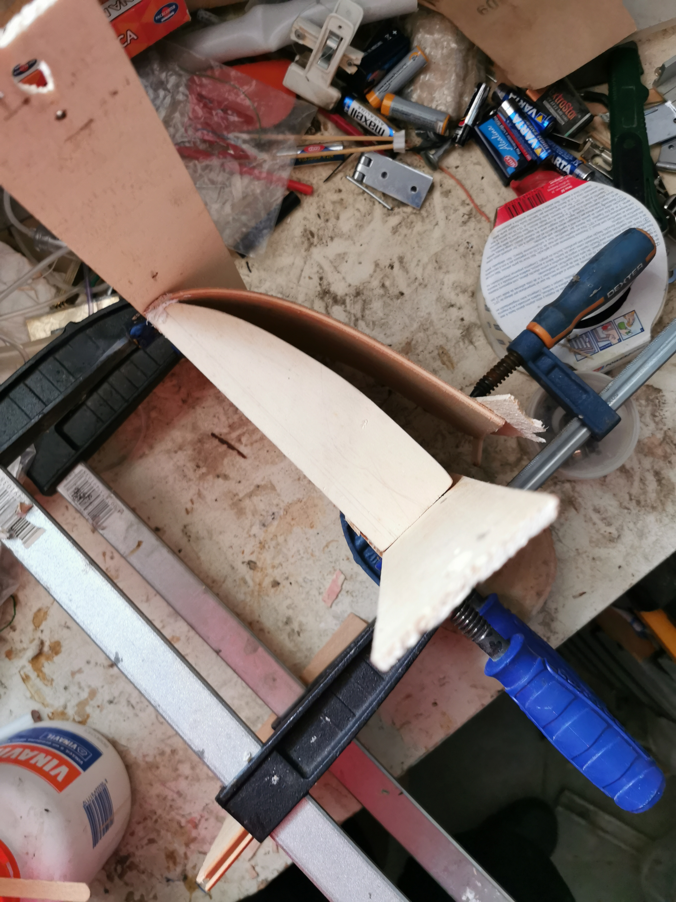

# Curving wood

## Description

I want to curve a wooden board over a previously built structure.

## Steps

1. wooden board in water for 1/2 hour (at least)
1. fix an extremity of the wooden board to the structure
1. press the fixed extremities with vices
1. using other vices, start flexing (gently) the wooden board
1. use hot sand bags or hot dryer to fasten the procedure
1. let the wooden board rest for at least 1 day. It has to dry
1. tighten vices a little at a time
1. when the wooden board is closed enough to the structure, spread glue between the two parts. Use a stick to pass between them
1. tight vices and make contact between the wooden board and the structure. The narrower the angle, the harder is to tighten. You can use wooden bars to press among the entire wooden board length.
    > IMPORTANT: keep the vices at the fixed extremities

## Images

First extremity fixed with glue and 2 nail. I made a small hole with a drill press before driving nails.